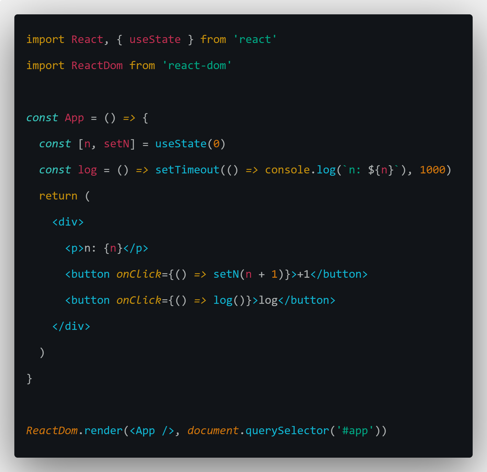
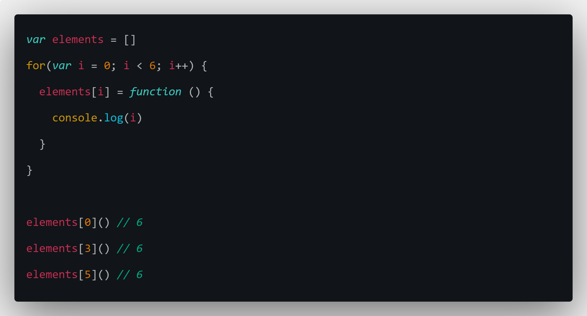
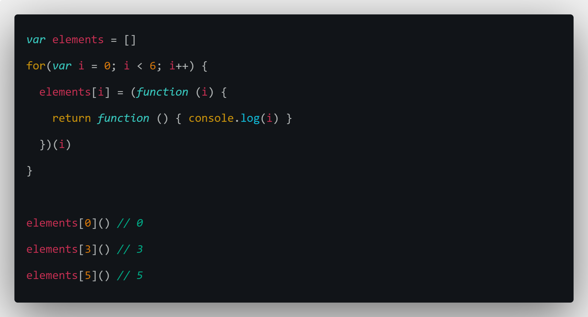
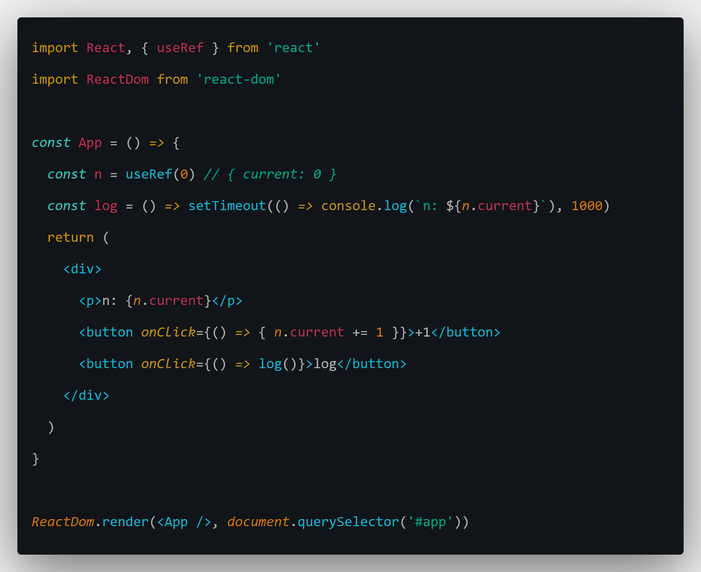
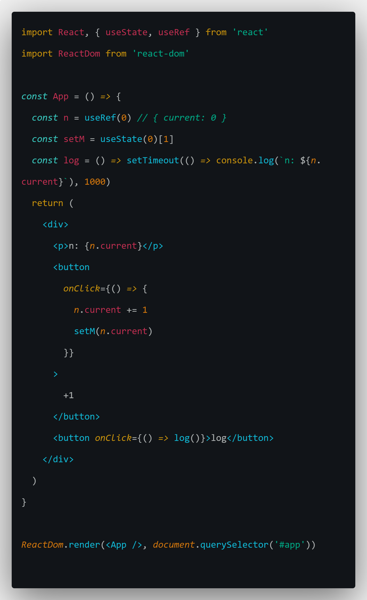

### 1. 数据的更新问题

观察上面的代码，然后进行下面的操作

1. 先 +1，再 log
2. 先 log，再 +1

会发现，打印出了两次`n: 1`，这里就有问题了，为什么先 log，再 +1，log 出的 n 仍然是旧的 n。

原因就是，每次重新渲染，App 函数就会执行，每次执行 App 函数，n 都是新的 n，和之前的 n 不同，和经典的闭包问题一样：

这里执行数组中的哪一个函数，都会输出 6，原因就是它们引用的 i 是同一个 i。

改成这样输出的 i 就和数组中函数的下标相同，虽然都是变量名都是 i，但是每次执行函数中的 i 都是不同的，例子中的 n 同理。

### 2. 保持 state 在重新渲染后仍然是之前的 state

1. useRef

   如果想要 state 在每次渲染后不会变成新的，可以使用 React 提供的 useRef 方法。

   

   官网文档上有说明：

   > useRef 返回一个可变的 ref 对象，其 .current 属性被初始化为传入的参数（initialValue）。返回的 ref 对象在组件的整个生命周期内保持不变。

   需要注意的是：

   > 请记住，当 ref 对象内容发生变化时，useRef 并不会通知你。变更 .current 属性不会引发组件重新渲染

   如果想要在改变 ref 对象的同时触发渲染，需要自己实现，比如：

   

   在改变 ref 对象的 current 属性值的时候，改变一下组件的 state，触发渲染。

2. useContext
