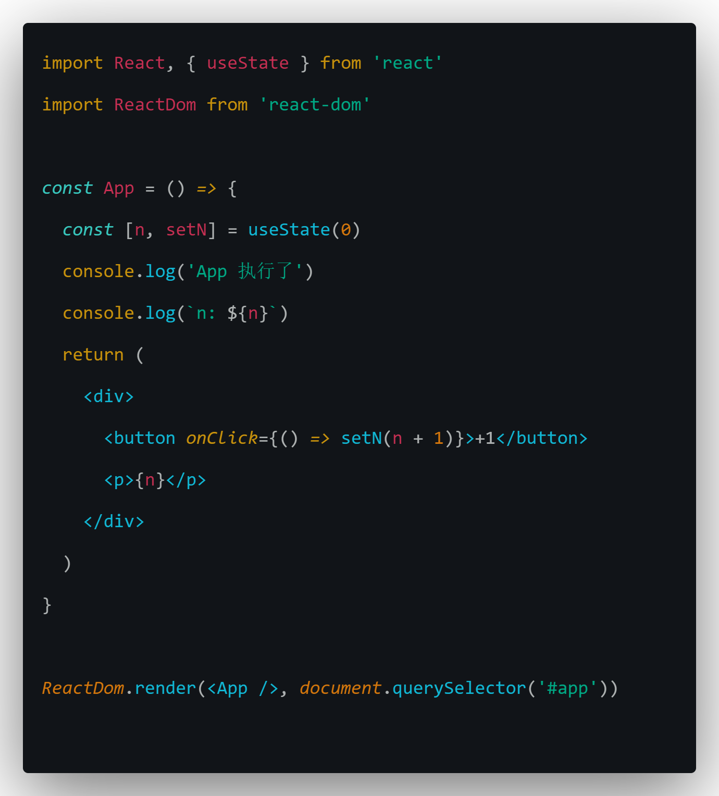
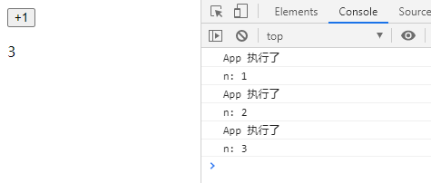
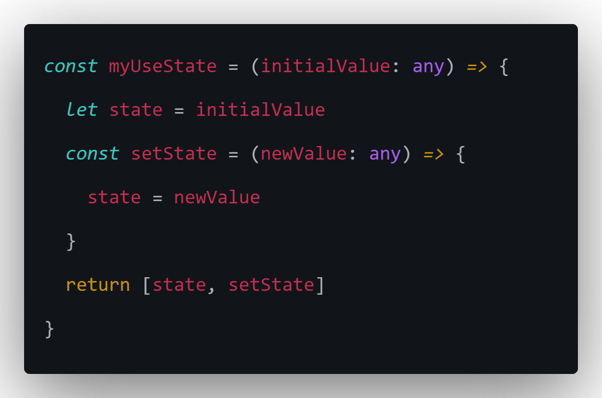
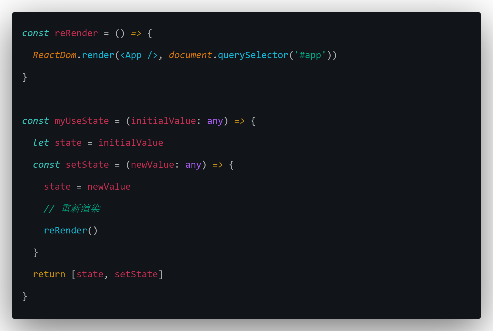
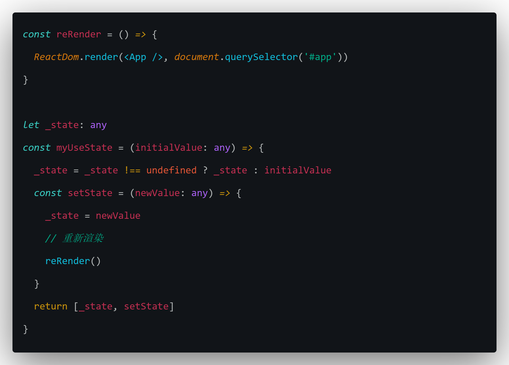
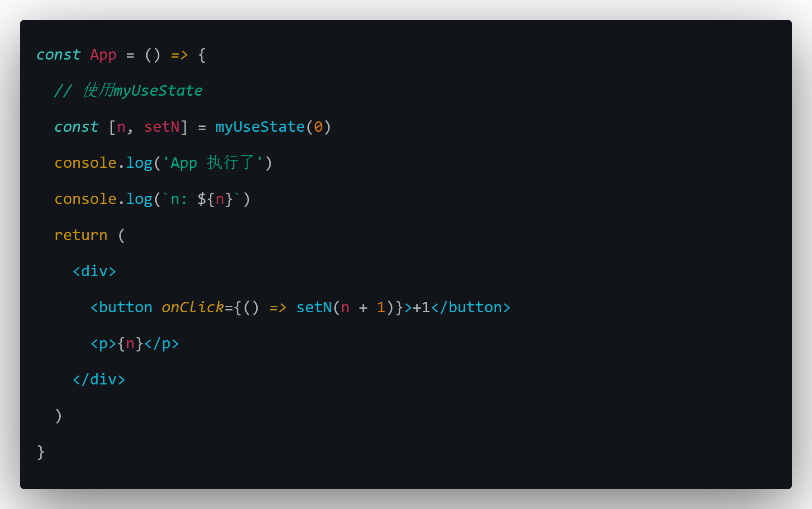
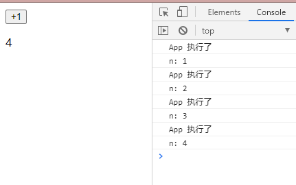
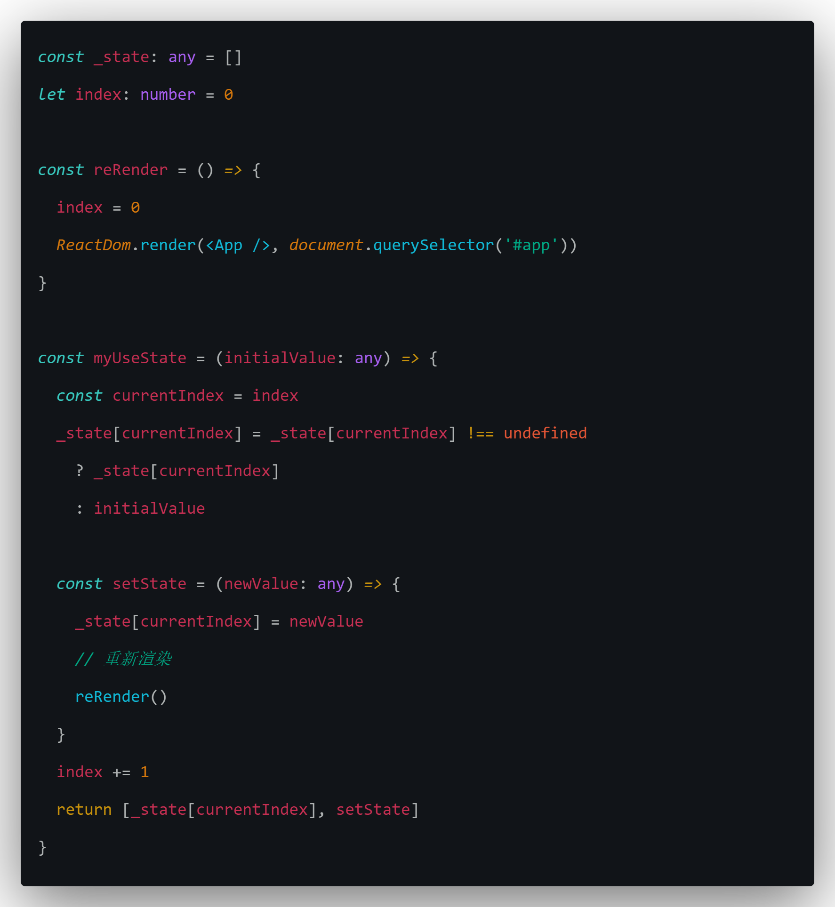
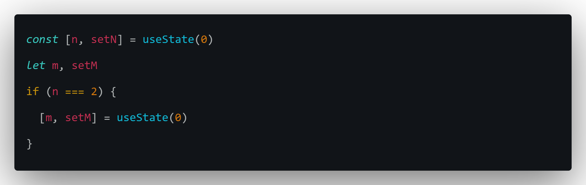

### useState 原理

1. 想象在 React 中，调用了 useState 会发生什么事

   

   

   从例子中看出，每次执行 useState，App 都会被执行，但是每次的 n 却是不同的，根据目前观察到的结果，自己实现一个 useState

2. 实现 useState

   - useState 会返回一个数组，数组的第一项为 state 的值，第二项为修改该 state 的方法
     
   - 每次修改完 state，会重新执行 App（重新渲染组件）
     
   - 每次重新渲染的 n 都是不同的
     

     把 state 存在 myUseState 外面，这样每次重新渲染的时候执行`myUseState(0)`的时候，state 就不会被重置成 0

3. 测试一下
   

   

   从实验结果看，是可行的，n 的值是对的，每次调用 setN，App 也会重新执行

4. 当拥有多个 state 的时候

   目前实现的 useState，有一个问题就是，当 App 拥有多个 state 的时候，会出现冲突，后面的 state 会覆盖前面的。

   优化：

   

   现在将\_state 改为数组，然后再保存一个 index 作为调用 myUseState 的次数，每次重新渲染的时候重置 index，这样多个 state 就不会有冲突了

5. 总结

   使用数组去存 state 的方案有一个问题就是，每次重新渲染时调用 useState 的次数，以及顺序必须是相同的，如果是有条件的调用 useState 就会出现 state 的值对不上的问题，在 React 中也是不允许出现这样的代码的：

   
